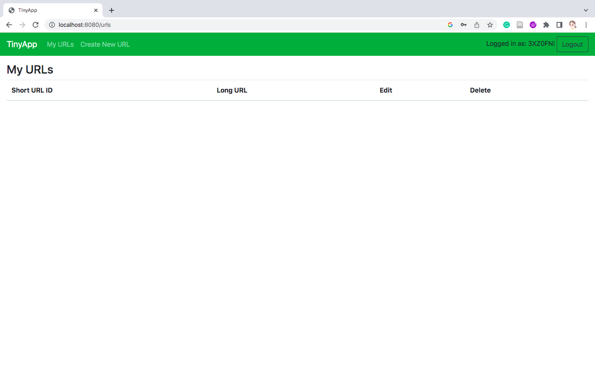
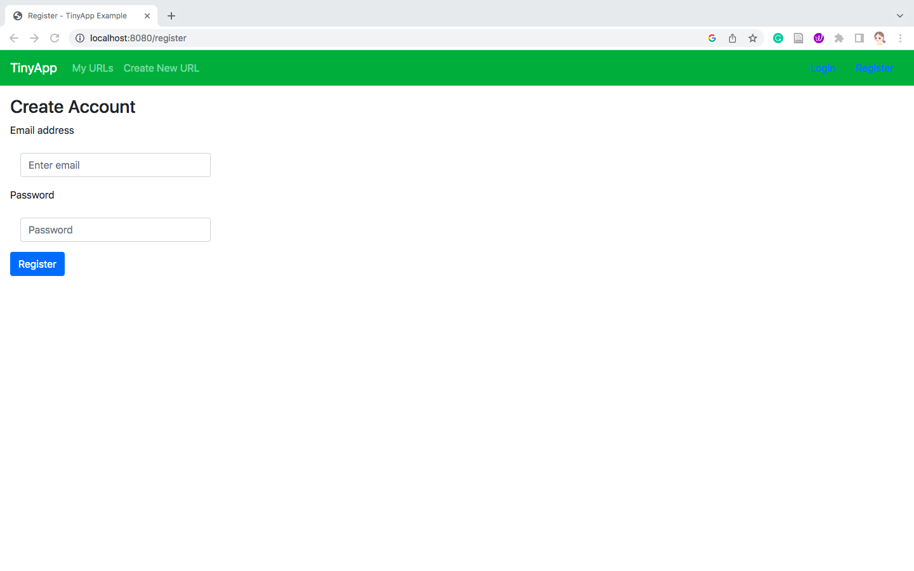
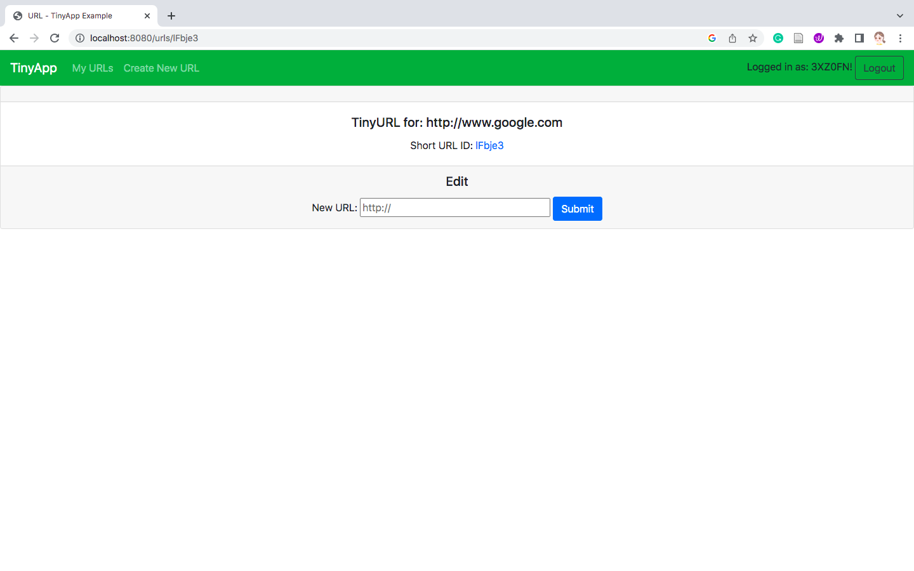

# TinyApp Project

TinyApp is a full stack web application built with Node and Express that allows users to shorten long URLs (à la bit.ly).

## Final Product

### - The Main Page
This is the page showing all the URLs that you submit and you can choose to edit and delete them.

### - The Register Page
This is the page that allow you to register.

### - The Edit Page
This is the page that allow you to edit your long URLs.

## Dependencies

- Node.js
- Express
- EJS
- bcryptjs
- cookie-session

## Getting Started

- Install all dependencies (using the `npm install` command).
- Run the development web server using the `node express_server.js` command./